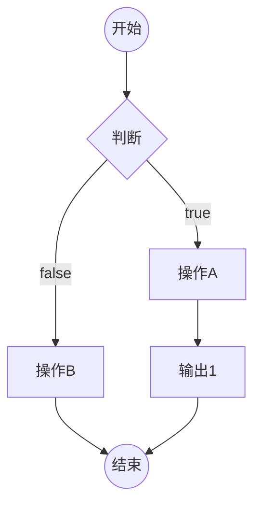
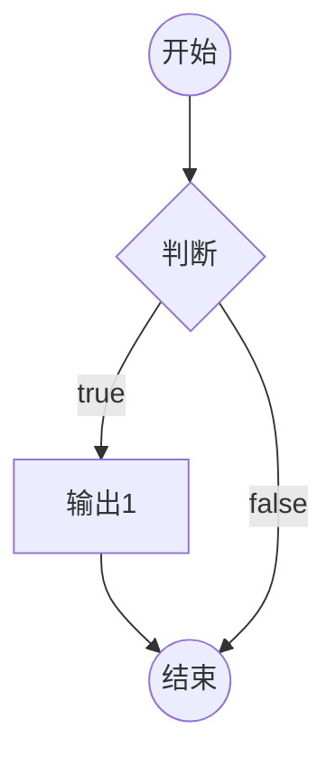
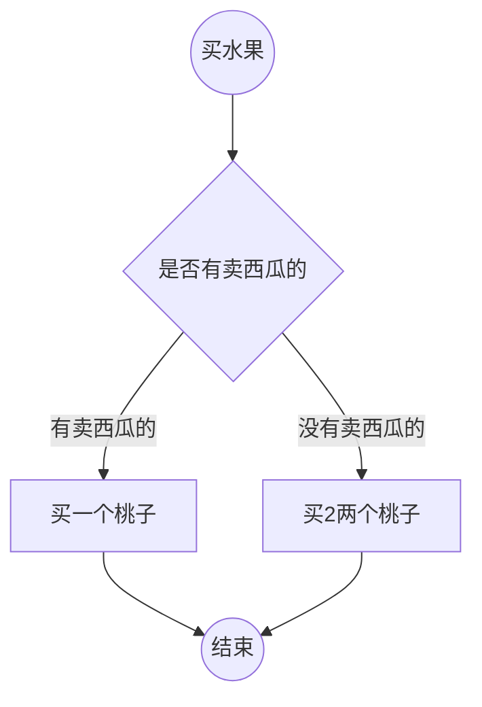
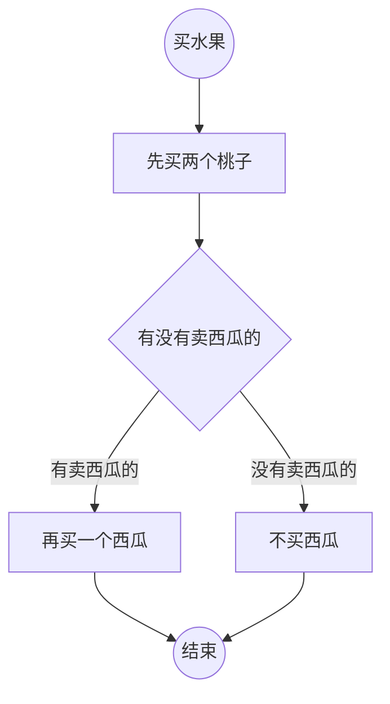

# 2-1 第一个JS程序

## 浏览器环境中，代码书写位置

1. 直接书写到页面中的script元素的内部
2. 书写到外部的js文件，在页面中引用[推荐]

代码分离：内容、样式、功能相分离，更加容易维护和阅读。

- 页面中，可以存在多个script元素，执行顺序从上到下
- 如果一个script元素引用了外部文件，内部不能书写任何代码
- script元素有一个可选的属性，type，该属性用于指定代码的类型，该属性值是MIME格式

## 认识基本语法

- 语法部分必须都是英文符号
- js代码由多条语句构成，每个语句用英文分号结束（并非强制要求）
- js代码从上到下同步执行
- js语言大小写敏感

## 认识输出语句

所有的输出语句都不是ES标准。

- document.write 将语句用于将数据输出到页面
- alert 该语句用于将数据用弹窗的形式显示到页面
- console.log 该语句用于将数据显示到控制台

## 认识注释

注释： 提供给代码阅读者，不会参与执行

1. // 双斜杠，单行注释
2. /* */ 多行注释。
在vscode中，使用快捷键 ctrl + / ，可以快速添加和取消单行注释
使用快捷键 alt + shift + a ，可以快速添加和取消多行注释

# 2-2 数据和数据类型

数据：有用的信息
数据类型：数据的分类   

## JS中的数据类型

### 原始类型
原始类型指不可再细分的类型
1. 数字类型 number

直接书写即可
0开头： 表示8进制
0x开头： 表示16进制
0b开头： 表示2进制

2. 字符串类型 string

字符串：一长串文本（0个或多个）
- 单引号 '
- 双引号 "
- 书名号 ` 模板字符串

在字符串中，如何表示一个特殊符号--->  转义字符（\）
\t 制表符
\n 换行符

3. 布尔类型 Boolean

布尔类型用于表示真或假两种状态

4. undefined类型

表示未定义，不存在

5. null 类型

表示空，不存在

### 引用类型

1. 对象 Object

**属性** ： 对象的成员

2. 函数 Function

## 得到数据的类型

在数据前加上typeof

## 字面量

直接书写具体的数据，叫做**字面量**

# 2-3 变量

## 什么是变量

变量是一块内存空间，用于保存数据。

> 计算机：CPU、内存、硬盘、输入输出设备
> 内存：存取速度快，数据易丢失
> 硬盘：存取速度慢，数据永久保存
> 计算机程序的运行，仅与内存打交道

## 如何使用变量

1. 声明（定义）变量

```js
var a ;//声明一个变量，名称为a，值为undefined。
```
- 变量的值是可变的
变量可以被重新赋值，新的值会覆盖原来的值

- 变量的名称
在开发中，凡是需要自行命名的位置，叫做标识符

标识符的规范：

1） [必] 只能以英文字符、下划线、$开头
2） [必] 其他位置可以出现数字、英文字母、下划线、$
3） [选] 标识符应该做到语义化
4)  [选] 如果有多个单词，使用驼峰命名法，单词首字母大写 大驼峰 、 小驼峰

- 声明和赋值合并
```js
var a = 123;
```

变量的申明和赋值可以一条语句书写。

这是语法糖。

语法糖仅仅是为了方便代码书写或记忆，并不会有实质性的改变。

- 多个变量可以合并申明并赋值

- **任何可以书写数据的地方，都可以书写变量**

- 若使用一个为声明的变量，会报错。

例外：使用typeof得到类型时，可以是未声明的变量，得到的结果是undefined。

- **JS中存在变量提升**

所有变量的声明，会自动的提到代码的最顶部

但是，这种提升，不会超越代码块。

# 2-4 变量和对象

原始类型: Number、String、Boolean、null、undefined

引用类型： Object、Function

## 在变量中存放存放对象

1. 通过变量，读取对象中的某个属性
```js
// 变量名.属性名
```

**当读取的属性不存在时，会得到undefined**

**当读取属性的对象不存在时/null/undefined，会报错**

2. 通过变量，更改对象中的某个属性

**当赋值的属性不存在时，会添加属性**

3. 删除属性
```js
delete 变量名.属性

或者直接赋值   变量名.属性 = undefined

两者实际上给是不一样的
```

4. 特殊的读取方式、属性表达式

给属性赋值或读取属性时，可以使用下面的格式

```js
对象变量["属性名"]
```

- 某些属性中包含特殊字符

实际上，JS对属性的命名要求并不严格，属性可以是任何形式的名字

**属性的名字只能是字符串，如果你书写的是数字，会自动转换为字符串**

## 全局对象

JS大部分的宿主环境，都会提供一个特殊的对象，该对象可以直接在JS代码中访问，该对象叫做全局对象。

浏览器环境中，全局对象为window，表示整个窗口。

全局对象红的所有属性，可以直接使用，而不需要写上全局对象名

开发者定义的所有变量，实际上，会成为window对象的属性

**name属性比较特殊，赋值的任何内容，都会被转换为字符串**

# 2-5 引用类型

原始类型 引用类型
**原始类型的变量，存放的是具体的值**
**引用类型的变量，存放的是内存地址**
**凡是出现对象里面量的位置，都一定在内存中出现一个新的对象**
> 扩展知识：JS中的垃圾回收
> JS引擎，会定期的发现内存中无法访问到的对象，该对象称之为垃圾，JS引擎会在合适的时间将其占用的内存释放。

# 3-1 运算符概述

## 操作符和操作数

操作符：运算符，参与运算的符号
操作数：参与运算的数据，也称之为“元”
操作符不一定只有一个符号

1. ``` = ``` 赋值符号，将右边的数据赋值给左边
2. ``` . ``` 访问符号，用于访问对象的属性
3. ``` [] ```访问符号，用于访问对象的属性
4. ``` () ```函数调用

## 分类

按操作数数量分：

1. 一元（目）运算符 () . []
2. 二元（目）运算符 + - * / % = 
3. 三元（目）运算符 ? :

功能区分
1. 算数运算符
2. 比较运算符
3. 逻辑运算符
4. 位运算符
5. 其他

## 表达式

表达式 = 操作符 + 操作数

每个表达式都有一个运算结果，该结果叫做**返回值**，返回值的类型叫做**返回类型**

所有的表达式都可以当做数据使用

目前学习的运算符的返回值和类型

1. ``` = ``` 该表达式，返回赋值的结果
2. ``` . ``` 属性访问表达式，返回的是属性的值
3. ``` [] ```属性访问表达式，返回的是属性的值
4. ``` () ```函数调用表表达式，返回的结果取决于函数的运行
5. 如果是一个声明加赋值的表达式，返回结果为undefined

> chrome浏览器控制台的环境是REPL环境
> REPL：Read  Eval  Print Loop 读-执行-打印-循环
> 档直接在控制台书写代码时，除了运行代码之外，还会输出该表达式的返回值。


# 3-2 算数运算符

数学运算符

```+ - * / % ++ -- **（指数）```

## 细节

> typeof函数返回类型为string
> isNaN，该函数用于判断一个数据是否是NaN，返回Boolean
> isFinite函数，该函数用于判断一个数据是否是有限的，返回Boolean

1. 小数运算是不精确的
2. 除数为0时，
- 被除数为正数时，结果为infinity;
- 被除数为负数时，结果为-infinity
- 被除数为0，结果为NaN
3. 求余
% 有的教程称之为求模

余数的符号，与被除数相同

## 其他类型使用算术运算

1. 除加号之外的算术运算符

- 将原始类型转换为数字类型（自动完成装换），然后完成运算

- Boolean ： true -> 1 false ->0

- String : 如果字符串内部是一个正确的数字，直接转变为数字；如果是非数字，则得到NaN。能识别infinity,不能把字符串内部的东西当做表达式。

"infinity" -> infinity

- NaN 虽然是一个数字，但是做任何运算他都是一个NaN

- null ： null -> 0 

- undefined : undefined -> NaN

- 将对象类型先转换为字符串，然后再将字符串转换为数字类型

对象类型转成字符串得到的结果是"[object Object]"

2. 加号运算符

- 加号一边有字符串，含义变为字符串拼接

- 将另一边的其它类型，转换为字符串类型

- 数字 -> 数字字符串

- boolean -> 'true' 'false' Boolean字符串

- null -> 'null'

- undefined -> 'undefined'

- 对象  "[object Object]"

- 加号两边都没有字符串，但一边有对象，将对象转换为字符串，按字符串拼接

# 3-3 自增和自减

## 基本功能

++ ： 将某个变量的值+1
-- ： 将某个变量的值-1

## 细节


### 自增自减表达式

x++ ： 将变量x自增1，得到的表达式的值是自增前的值。
++x ： 将变量x自增1，得到的表达式的值是自增后的值。

自减同理。

### 优先级

从高到低 
1. ```++ --```
2. ```* / %```
3. ```+ -```

优先级运算的细节

1. 从左到右依次查看
2. 遇到操作数，将数据的值直接取出
3. 如果遇到相邻的两个运算符，并且左边的运算符优先级大于等于右边的运算符，则直接运行左边的运算符。

# 3-4 比较运算符

大小比较： > <  >= <=
相等比较： == === != !==严格不相等

**比较运算符的返回类型是Boolean值**

**算术运算符的优先级高于比较运算符**

## 大小比较

### 细节

1. 两个字符串比较大小，比较的是字符串的字符编码。

2. 如果一个不是字符串，并且两个都是原始类型，将他们都转换为数字进行比较。

- NaN与任何数字比较，得到的结果都是false。

- infinity比任何数字都大，-infinity比任何数字都小。

3. 如果其中一个是对象，将对象转换为原始类型，按照规则1或规则2进行比较。

- 目前，对象转换为原始类型后为```'[object Object]'```

## 相等比较

### == 相等比较 和  != 不相等比较

== ：比较两个数据是否相等
!= ：比较两个数据是否不相等

**细节**

1. 两端的类型相同，直接比较数据本身是否相等。（两个对象比较的是地址）

2. 两端的类型不同

- null 和 undefined ，他们直接相等，和其他原始类型比较，则不相等。
- 其他原始类型比较时，先转换为数字，再进行比较
- NaN与任何数字比较，都是false，包括自己
- infinity和-infinity只和自身相等
- 对象比较时，要先转换为原始类型后，再进行比较

**由于相等和不相等比较，对于不同类型的数据比较违反直觉，因此我们不适用这种比较方式，而是使用更加接近直觉的严格相等和严格不相等**

### === !==
=== ： 两端的数据或类型必须相等
！==： 两端的数据或类型不相等

1. 两端类型相同，规则和== 相同
2. 两端类型不同，false

## 3-5 逻辑运算符

布尔运算符

## 与-并且 &&

书写方式： 表达式1 && 表达式2

1. 将表达式1进行布尔判定

以下数据均判定为false

1) null
2) undefined
3) false
4) NaN
5) ''
6) 0

其他数据全部为真。

2. 如果表达式1的判定结果为假，则直接返回表达式1，而不执行表达式2；否则，返回表达式2，

3. 短路原理，遇到假就返回，否则就返回最后一个值。


## 或 ||

1. 返回第一个真值或最后一个值

## 非 !

1. 一元运算符，将数据的布尔判定结果取反，返回的类型一个是布尔类型。

**优先级比较高**

# 3-6 三目运算符

1. 表达式1 ？ 表达式2 ： 表达式3

2. 对表达式1进行布尔判定，结果为真，返回表达式2；否则，则返回表达式3.

# 3-7 运算符补充

## 模板字符串
'' 
"" 
``  
```js
 var a = 123
 let chen = `我的分数为${a}`
```
## 类型转换不会影响原本的数据

## 复合的赋值运算符
+= -= /= *= %= **=(求幂)
```js
x *= 1 + 2 // =>  x = x * (1 + 2)
```
## void运算符
一元运算符
写法：
1. 普通写法：```void 表达式 ```
2. 函数写法：```void(表达式)```
运行表达式，返回undefined。
## typeof 运算符
一元运算符
写法：
1. 普通写法：```typeof 表达式 ```
2. 函数写法：```typeof(表达式)```
typeof运算，返回的结果类型为字符串
## 逗号运算符
写法： 表达式1 ， 表达式2

依次运行两个表达式，返回表达式2

逗号运算符的优先级比赋值号更低

# 3-7 [扩展]数字的存储

**在对精度要求很高的系统中，或要对小树的运算结果进行比较时，需要特别谨慎**

## 问题
1. JS中的小数运算是精确的吗？ 

不一定

2. JS中的整数运算是精确的吗？ 

不一定

3. JS中表示的整数是连续的吗？

不是，数字很大的时候就不连续了

4. JS中表示的最大数字是多少？

最大连续整数：Number.MAX_SAFE_INTEGER  9007199254740991

5. JS中能表示的数字的有效位数是多少？

16 ~ 17 位

## 二进制

现实世界中：十进制，十个数字，逢十进一

计算机世界中：二进制，2个数字，逢二进一

二进制-> 十进制

11.01 => $1*2^1 + 1 * 2^0 + 0*2^-1+1*2^-2$

十进制 -> 二进制

整数部分除2取余，反向取数，商为0结束

小树部分乘2取整，正向取数，小数位置为0结束

## 为什么JS的小数运算不精确

十进制的小数，转换为二进制后，可能是无限小数,但是计算机对数字的存储能力有限，因此会丢失一些数据。

0.3 -> 0.0100110011001

计算机中如何查看

```
var a = 0.3

a.toString(2)
```

## JS如何存储数字

整数法、浮点法

JS中，存储的所有数字，都按照浮点法存放。

浮点法存放的数字，叫做浮点数（float），浮点数分为单精度和双精度。

JS中，使用双精度存放浮点数，IEEE 754标准。

**存放方式**

JS在计算机中，给每个数字开辟一个内存空间，尺寸固定为64位。

> 在计算机中，位（bit）是最小的存储单位，简称为bit
> 1 byte = 8 bit
> 1 KB = 1024 byte
> 1 MB = 1024 KB
> 1 GB = 1024 MB
```
[第一段][第二段][第三段]

第一段：1位，表示符号位，如果是1，是负数，如果为0，是正数
第二段：11位，表示指位数，这里的指数是2为底的指数，而不是10
第三段：52位，表示有效数字
[1][2-12][13-64]
```

0 0000 0000 011 1111 0000 0000 ...

相当于： $ 1.1111 * 2 ^ { 3 - 1023 } $

**特殊情况**

1. 指数为0，尾数为0，表示数字 0
2. 符号为0，指数为2047，尾数也为0，表示正无穷
0 1111 1111 111 00000000000000.....  infinity
3. 符号为1，指数为2047，尾数也为0，表示负无穷
1 1111 1111 111 00000000000000..... -infinity
4. 指数为2047，尾数不为0，表示NaN
1 1111 1111 111 010101010100101...  NaN

**一个正常的数字，指数部分最多是2046**

## 能表示的最大数字

0 1111 1111 110 111111111111111111111111111111...


# 4-1 流程图

一套标准的图形，用于描述程序的逻辑

通常流程图分析程序的流畅

## 在markdown 中画流程图



(()) 表示圆
[] 表示正方形
{} 表示菱形

## 例子





# 4-2 if判断

```js
if(条件1){
    //代码块
}else if(条件2){
    //代码块
}
else if(条件3){
    //代码块
}else{
    //代码块
}
```
1. 如果某个条件满足，则直接忽略后面所有的条件
2. else if可以有多个（包含0个）
3. else可以有1个或0个
4. else可以换行，也可以不换行
5. 如果代码块只有一句语句，可以省略花括号（不推荐）
6. if只能出现一次

## 补充-用户输入
```js
prompt('提示文本') 
```
该函数的返回值有2种情况：
1. 返回null，用户点击了取消
2. 用户输入的字符串：表示用户点击了确定，得到用户输入的结果
3. 得到一个随机数
 Math.random() 该表达式返回一个0~1之前的随机数字（无法取到1）

## 类数组
1. 属性为索引属性，必须有length属性，最好加上push
```js
var obj = {
    0:'a',
    1:'b',
    2:'c',
    'push':Array.prototype.push,
    'splice':Array.prototype.splice
}

Array.prototype.push = function(target){
    this[this.length] = target;
    return this.length  ;
}


```
 


